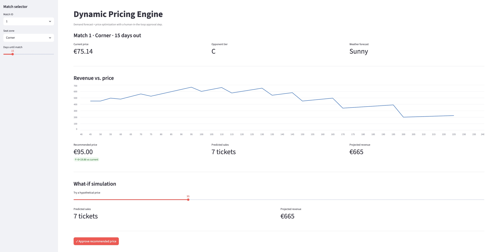

# Dynamic Pricing Engine with HiTL

<p align="left">
  
  
  
  <a href="LIVE_DEMO_URL"></a>
</p>

An ML-powered dynamic pricing and decision support system for ticket pricing in a sports stadium. The engine forecasts demand at any candidate price, grid-searches for the revenue-maximizing recommendation, and surfaces it on a one-click approval dashboard. The same architecture was deployed on a real club's ticketing data and delivered **+6% revenue per match** and **86% recommendation adoption** by the commercial team (see [Real-world deployment](#in-the-real-world-deployment) for the full results).

<p align="center">
  <a href="LIVE_DEMO_URL"></a>
  <br>
  <em>Pick a match and zone, see the recommended price and the revenue-vs-price curve, then approve. <a href="LIVE_DEMO_URL">▶ Try the live demo</a>.</em>
</p>

## Quickstart

```bash
pip install -r requirements.txt
make all          # synthetic data, train, holdout evaluation, elasticity sanity check
make app          # open the human-in-the-loop Streamlit page locally
```

---

## The problem

The challenge: transform a static, manual pricing strategy into a responsive, automated system with a human-in-the-loop, creating a market-driven approach to setting ticket prices per match. Prices were historically set once per season in rigid categories and updated weekly or monthly. The team would manually pull data from several systems, propose changes, then push them to the live ticketing platform by hand. The engine collapses that loop into "data → recommendation → one-click approval → live price".

<p align="center">
  
  <br>
  <em>Fig. 1: A standard stadium ticket pricing by zone during the checkout process.</em>
</p>

<details>
<summary>Click for the full problem ↔ solution breakdown</summary>

| 🚩 Problem | 💡 Solution |
| :--- | :--- |
| **Static pricing**: prices set once per season in rigid categories (A++, A, B), updated weekly/monthly. | **Dynamic recommendations**: price proposals per seating zone based on near real-time data analysis, allowing daily updates. |
| **Manual adjustments**: slow analysis to propose changes. | **Impact simulation**: instantly model projected impact of any price change on revenue and ticket sales. |
| **Data bottleneck**: manual extraction from fragmented systems. | **Centralized data**: aggregates sales, web analytics, contextual data into one place. |
| **Slow implementation**: disconnected from the sales platform. | **Seamless integration**: one-click approval on a dashboard pushes a price update to the live ticketing system. |

</details>


## System at a glance

The **Dynamic Pricing Engine** ingests historical data from the **Club's Data Systems** and real-time sales from the **Ticketing System**, recommends prices that are simulated and approved by the **Club's Pricing Team**, and pushes approved prices back to the live ticketing system where fans complete a purchase. That last step closes the feedback loop.

<p align="center">
  
  <br>
  <em>Fig. 2: System Context Diagram – Dynamic Pricing System.</em>
</p>

<details>
<summary>Click for the high-level market-dynamics view</summary>

<p align="center">
  
  <br>
  <em>The engine acts as the central brain balancing the club and the fan, ingesting internal and external factors to forecast demand at various price points.</em>
</p>

</details>


## Results

### In this repo (synthetic data)

`make evaluate` runs a 14-day per-series holdout. The ensemble is re-trained from scratch on the train split before predicting on the holdout, so the numbers below are leakage-free.

| Metric | Ensemble (Prophet + XGBoost) | Baseline (mean) |
| :--- | :--- | :--- |
| **WAPE** | **26.7%** | 79.7% |
| **R²** | **0.726** | -0.428 |
| **MAE** | **6.2** tickets | 18.6 tickets |
| **RMSE** | **11.8** tickets | 27.0 tickets |

The ensemble's WAPE is **67% lower** than the mean baseline. Reproducible with `RANDOM_SEED=42` in `src/data/make_dataset.py`.

A common failure mode for demand models is to learn everything *except* the price-to-sales relationship, leaving the optimizer to recommend the price cap on every row. `make sanity` defends against this: it samples 20 historical rows, sweeps each through the optimizer's price range, and asserts that predicted sales move with price by at least 20% relative spread. Latest run: **mean spread 11.6 tickets across the per-zone range**, **median optimal price €182** (well inside the search band), **0% violation rate**.

### In the real-world deployment

> ℹ️ These numbers are **not** reproduced by this repository – they come from a deployment on a confidential real-world dataset. Treat them as case-study evidence, not a benchmark.

| Metric | Result | Description |
| :--- | :--- | :--- |
| 📈 Revenue uplift | **+6%** avg. revenue per match | Achieved by dynamically adjusting prices to match real-time demand forecasts. Validated via A/B testing. |
| 🎟️ Optimized sales | **+4%** sell-through rate | Improved occupancy alongside revenue, which positively affects atmosphere and in-stadium sales. |
| ⚙️ Operational efficiency | **7×** faster price changes | From weekly to daily updates by automating data aggregation and analysis. |
| 🤝 Recommendation adoption | **86%** of proposals approved | Commercial team reviewed and approved the model's price proposals at a high rate, indicating trust. |

The engine was validated via **segment-based A/B tests**: a subset of seating zones used the dynamic engine (treatment), the rest stayed on static pricing (control). Tests ran across matches of varying importance to ensure the lift wasn't an artifact of any single event. The +6% revenue lift held alongside a +4% sell-through rate, confirming the engine found market equilibrium rather than simply over-charging.


## How the engine works

Two stages: first **predict**, then **optimize**.

<p align="left">
  
  <br>
  <em>Fig. 3: Dynamic Pricing Engine component.</em>
</p>

### Stage 1 – Demand forecasting

A Prophet + XGBoost residual ensemble. One Prophet model per `(match_id, seat_zone)` series captures temporal structure (trend, weekly seasonality, weekday/holiday effects). A single XGBoost regressor then fits Prophet's in-sample residuals using the full feature set (price, demand signals, external factors), picking up the non-linear interactions Prophet misses. The combination beats either alone on the holdout. The unified prediction surface lives in `src/models/predict_demand.py` as `DemandModel.predict()`.

<details>
<summary>Click for design choices and trade-offs (Stage 1)</summary>

| Aspect | Description |
| :--- | :--- |
| **Stage A – Prophet** | One model per `(match_id, seat_zone)` series captures trend, weekly seasonality, and weekday/holiday effects via Prophet regressors. |
| **Stage B – XGBoost** | A single XGBoost regressor is fit on Prophet's in-sample residuals using the full feature set. |
| **Prediction** | `final = clip(prophet_yhat + xgb_residual, 0, ∞)`. |
| **Why this split** | Prophet handles temporal structure cleanly; XGBoost picks up complex non-linear interactions Prophet cannot. The combination beats either alone on the holdout. |

</details>

### Stage 2 – Price optimization

Grid search over a **zone-aware** range of prices: `[0.5 × base_price, 2.5 × base_price]`. Outside this band the model would be extrapolating beyond the training distribution and the residual XGBoost can't be trusted; the band is configurable in `src/decision_engine/constants.py` (`PRICE_SEARCH_RANGE_RATIO`). For each candidate price, the engine builds a row, predicts sales with `DemandModel`, computes `revenue = price × predicted_sales`, and returns the argmax. The result becomes a `Price Variation Proposal` sent to the commercial team for approval.

<details>
<summary>Click for design choices and trade-offs (Stage 2)</summary>

| Aspect | Description |
| :--- | :--- |
| **Why grid search** | Pricing is a critical business decision; grid search **guarantees** the revenue-maximizing price within the search space, at modest compute cost (one vectorized prediction batch per match-zone). |
| **Process** | For each candidate price in the range, build a row, predict sales with `DemandModel`, compute `revenue = price × predicted_sales`, return the argmax. |
| **Why not Bayesian opt.** | Bayesian optimization would converge faster but doesn't guarantee the maximum. For pricing decisions, the guarantee is worth the modest extra cost. |

</details>


## The dataset

The repository ships a synthetically generated dataset engineered to mirror the complexity and statistical properties of a real ticketing environment: 10 matches of varied importance, a 90-day daily sales window per match, and up to 5 stadium zones per match (a small per-zone dropout probability removes some pairs to mimic real data gaps, yielding ~37-43 of the 50 possible series).

> ⚠️ **`web_conversion_rate` is deliberately dropped from the model's feature set** (`src/features/build_features.py`). It is defined as `sales / web_visits` in the generator, which is target leakage at decision time: when we propose a price, the conversion rate at that price is precisely what we are trying to predict. Including it would inflate the headline metrics while breaking the optimizer's price-elasticity signal.

<details>
<summary>Click for the full feature schema</summary>

| Category | Features | Description |
| :--- | :--- | :--- |
| **Match & Opponent** | `match_id`, `days_until_match`, `is_weekday`, `opponent_tier`, `ea_opponent_strength`, `is_international` | Core details about the match, its timing, and opponent quality. |
| **Team Status** | `team_position`, `top_player_injured`, `league_winner_known` | Current performance, player status, and league context. |
| **Ticket & Zone** | `seat_zone`, `ticket_price`, `ticket_availability_pct`, `zone_seats_availability` | Attributes of the specific ticket and seating area. |
| **Demand & Hype** | `internal_search_trends`, `google_trends_index`, `social_media_sentiment`, `web_visits` | Digital signals measuring interest and purchase intent. |
| **External Factors**| `is_holiday`, `popular_concert_in_city`, `competitor_avg_price`, `flights_to_barcelona_index` | External events, competition, and tourism proxies. |
| **Weather** | `weather_forecast` | Forecasted weather conditions for the match day. |

> **`zone_historical_sales`** [Target Variable] – the historical number of tickets sold in a given zone-day. This is what the model predicts.

</details>

<details>
<summary>Click for how prices and sales are generated</summary>

Two pieces of the data generator carry the model's job:

1. **Price has a wide, partly-independent distribution.** Real-world prices reflect both a strategic baseline tied to match excitement *and* operational variation (A/B tests, promotions, last-minute discounts). The generator implements both, so price varies roughly between `0.5×` and `2.5×` the zone's base price even within a single excitement level. Without this, the model cannot identify price elasticity from historical observations alone.
2. **Demand follows a linear-elasticity curve with a hard ceiling at `2.5×` base price.** This yields a clean interior revenue optimum near `~1.25×` base, rather than a runaway "pick the price cap" recommendation.

</details>

<details>
<summary>Click for the Match Excitement Factor</summary>

The generation script unifies non-price demand drivers under a single **"Match Excitement Factor"**:

1. **Starts with the opponent**: a top-tier opponent generates more interest.
2. **Adjusts for context**: league position, player injuries, match importance (e.g. league winner already decided), proximity to holidays, weekday/weekend.
3. **Drives the demand signals**: `google_trends_index`, `social_media_sentiment`, `internal_search_trends` all scale with this factor.

</details>


## Repository layout

```bash
dynamic-pricing/
├── Makefile                            # Pipeline: data → train → evaluate → sanity → app
├── README.md
├── app.py                              # Streamlit HiTL page
├── config.py                           # Paths and reference dates
├── requirements.txt
├── assets/                             # Diagrams and images
├── data/
│   └── 03_synthetic/
│       └── synthetic_match_data.csv    # Generated by make_dataset.py
├── models/                             # Trained artifacts (regenerable, gitignored)
│   ├── prophet_models.joblib
│   ├── xgb_residual_model.joblib
│   └── feature_pipeline.joblib
└── src/
    ├── data/
    │   └── make_dataset.py             # Synthetic data generator (seeded)
    ├── features/
    │   └── build_features.py           # Pipeline factory: drops, scales, one-hot encodes
    ├── models/
    │   ├── train_demand_model.py       # Fits Prophet + XGBoost ensemble
    │   ├── predict_demand.py           # DemandModel: unified predict() surface
    │   ├── evaluate.py                 # Leakage-free holdout metrics
    │   └── sanity_check.py             # Asserts the model actually responds to price
    └── decision_engine/
        ├── simulate.py                 # What-if for a single price
        ├── optimize.py                 # Zone-aware grid-search optimal price
        └── constants.py                # Sample feature row + zone base prices
```

### Reproducing the results

```bash
pip install -r requirements.txt
make clean                              # remove cached artifacts
make all                                # data + train + evaluate + sanity check
make app                                # launch the Streamlit page

# Or run the CLI examples directly:
python -m src.decision_engine.simulate
python -m src.decision_engine.optimize
```

The Streamlit page lets you pick a match and seat zone, see the recommended price with a revenue-vs-price curve, simulate any hypothetical price, and **approve** the recommendation – which appends a JSON line to `proposals.jsonl`. That's the HiTL loop in miniature.

---

## License

MIT

<br>

*Built ~~by~~ with AI.* <br>
© 2026 trm
